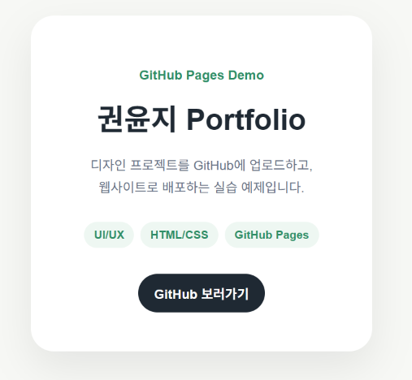

# Portfolio Demo

전공 발표에서 GitHub 사용 흐름을 보여주기 위한 포트폴리오 데모 프로젝트입니다.

이 저장소는 HTML/CSS 파일을 GitHub에 업로드하고, Commit으로 작업 기록을 남긴 뒤, GitHub Pages를 통해 웹사이트로 배포하는 과정을 실습하기 위해 만들었습니다.

## 프로젝트 목적

- Repository 생성 과정 이해하기
- README로 프로젝트 소개 작성하기
- 파일 업로드 후 Commit 메시지 남기기
- Issue로 수정 요청과 피드백 관리하기
- Branch로 원본을 건드리지 않고 수정안 작업하기
- GitHub Pages로 웹 포트폴리오 배포하기

## 파일 구성

- `index.html` : 웹페이지 구조
- `style.css` : 웹페이지 스타일
- `README.md` : 프로젝트 소개 문서
- `.gitignore` : GitHub에 올리지 않을 파일 설정

## 사용 기술

- HTML
- CSS
- GitHub
- GitHub Pages

## GitHub 실습 흐름

1. Repository 생성  
   프로젝트 파일을 담을 온라인 저장소를 만듭니다.

2. README 작성  
   프로젝트 소개, 목적, 파일 구성을 정리합니다.

3. 파일 업로드 & Commit  
   HTML/CSS 파일을 업로드하고, 작업 내용을 Commit 메시지로 기록합니다.

4. Issue 작성  
   수정할 내용이나 피드백을 Issue로 남깁니다.

5. Branch 생성  
   원본을 바로 수정하지 않고, 새로운 작업 흐름에서 수정안을 만듭니다.

6. Pages 배포  
   GitHub Pages를 활성화하여 웹사이트로 공개합니다.

## 데모 설명

이 프로젝트는 간단한 포트폴리오 카드 페이지입니다.  
디자인 프로젝트 결과물을 웹사이트 형태로 공유하는 상황을 가정하여 제작되었습니다.

## 미리보기

## 배포 주소

GitHub Pages 배포 후 아래에 링크를 추가합니다.

- https://ykunjii-creator.github.io/portfolio-demo/

## 발표자

경디공 PRE18기 권윤지